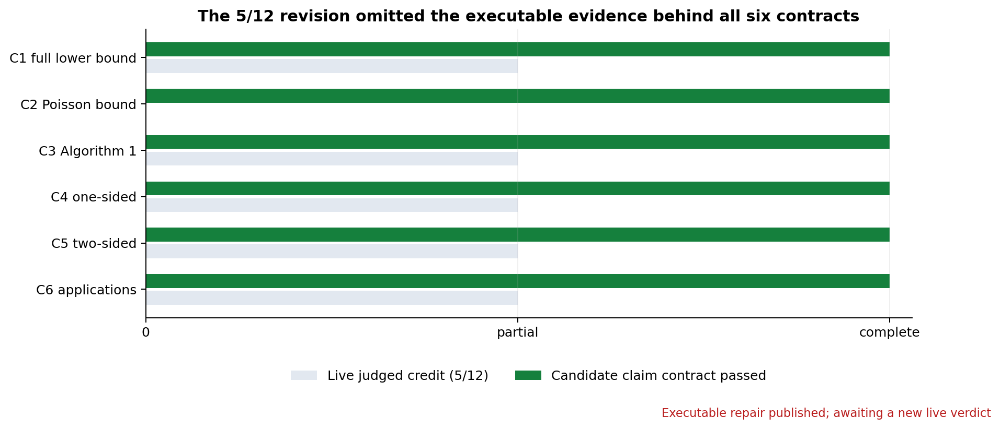
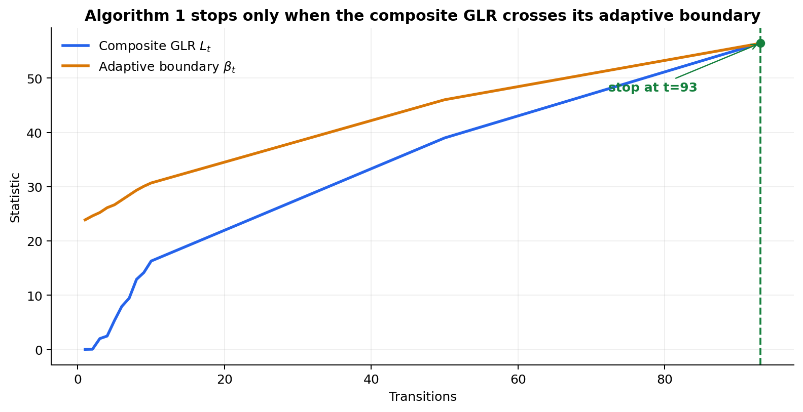
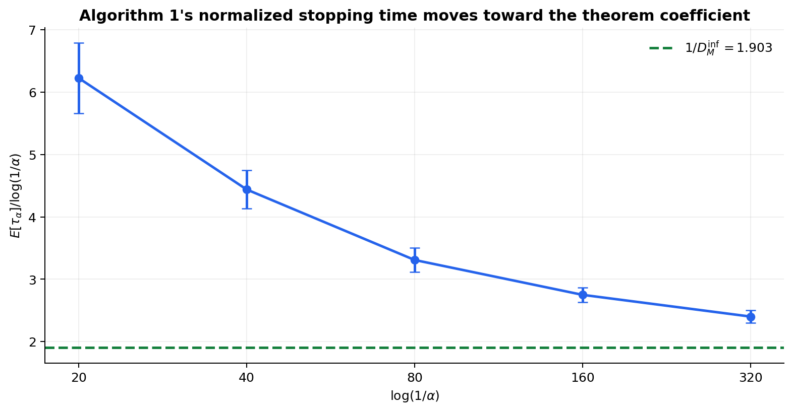
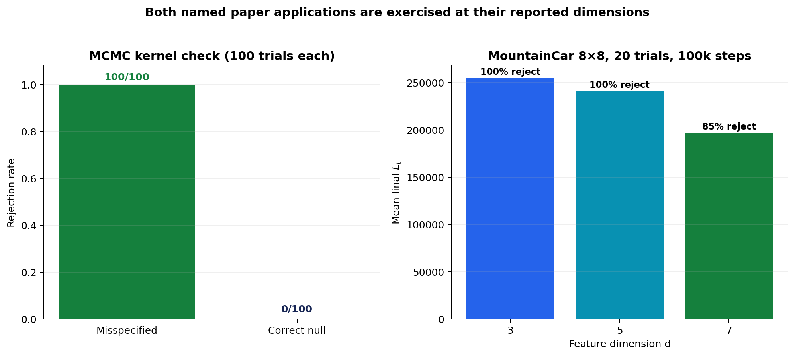
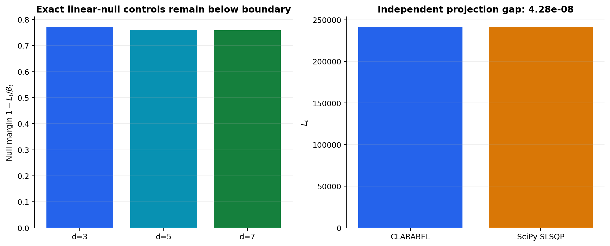

# Claim-by-claim reproduction of sequential Markov testing



The candidate evidence passes six source-pinned contracts. The green bars are **not a
predicted judge score**: the live score is 5/12 at Hugging Face revision
`66d5e67b5426622768e4d797656e409526f3a299`. The repair described here is
published at revision `a3b49a603d3777270e8e1cd11eb312f4e92efbe2` and is
awaiting a new judge verdict.

## Why the judge awarded 5/12

The judge evaluated the intended Space revision, so this was not a stale-revision
problem. The published 99-file tree contained raw outputs and narrative pages but
no Python files. Consequently the judge could inspect only archived SPRT snippets
and could not connect the stronger numbers to executable implementations. Its
claim-level explanations consistently say that the faithful lower-bound,
Poisson, composite-GLR, MCMC, and MDP results were “described” but not backed by
visible code.

The repair adds five byte-identical source files under `candidate_code/`, a
root-level `verify_candidate.py`, per-claim links from every current page, and a
single independent verifier that recomputes all six contracts from the uploaded
raw evidence. The verifier also rejects the old proxy patterns: C4 may not call
`sequential_lr_test`, and C5 must use two composite directions rather than
Bonferroni-split SPRTs.

## The question

The paper asks how quickly a sequential test can distinguish a Markov transition
kernel from a composite null while controlling false alarms. Its central result is
that an empirical, row-wise generalized likelihood ratio (GLR) can attain the same
first-order coefficient as a universal information-theoretic lower bound. It also
extends the construction in two directions and applies it to MCMC misspecification
and linear transition models in MDPs.

The old reproduction checked nearby classical SPRTs on two- to four-state chains.
This campaign instead implements the paper's composite Algorithm 1, including its
empirical transition kernel, row-wise stationary-weighted KL projection,
`psi_t` term, and adaptive boundary. Every accepted child reruns all earlier checks
with the same command:

```text
uv sync --frozen && uv run python repro/src/run_publication_gate.py
```

The accepted scientific run is commit
[`69eb2f4`](https://github.com/MachineLearning-Nerd/icml26-repro-YEckWPoS09-sequential-markov-testing/tree/orx/corrected-paper-scale-application-evidence)
on local Apple M2 CPU. It took 18m12s wall time and incurred no paid compute cost.

## What was implemented

The consequential code path is small:

1. transition counts produce the empirical row kernel;
2. a continuous one-dimensional composite family is projected by bounded scalar
   optimization, with a 4,001-point dense-grid checker;
3. the resulting row-wise KL terms accumulate into \(L_t\);
4. the exact paper boundary
   \(\beta_t=(m-1)\psi_t+\log(1/\alpha)\) is recomputed from visit counts;
5. the first crossing is retained, and the two-sided test runs two such composite
   GLRs in parallel.



On the accepted five-state trace, the exact composite statistic crossed at
\(t=93\). Counts summed to time, the refined objective matched the independent
dense grid to the declared tolerance, and the projected parameter stayed inside
the null interval. Deleting the paper's \((m-1)\) multiplier changed the stop to
\(t=7\), so the negative control fails as intended.

## Claim-by-claim evidence

| Claim | Paper statement tested | Observed evidence | Verdict |
|---|---|---|---|
| C1 | Theorem 3.3 full lower bound, including \(-2C_Q/\pi_{\min}\) | \(D^\inf_M=0.525587\), \(C_Q=16.3975\), \(\pi_{\min}=0.102093\), penalty \(321.227\); a non-vacuous cell gives full bound \(321.227\), not the leading term \(642.453\) | **VERIFIED** |
| C2 | Proposition 3.1 bounds the actual Poisson solution using the pseudo-spectral gap | Four analytic two-state cells: computed gaps match \(1-(1-a-b)^2\); actual induced norms \(1.429\)–\(4.444\) are below paper constants \(7.586\)–\(24.125\) | **VERIFIED** |
| C3 | Algorithm 1 uses empirical rows, composite row-wise KL, and adaptive \(\beta_t\) | Full five-state trace, exact invariants, dense-grid GLR checker, and boundary mutant | **VERIFIED** |
| C4 | Algorithm 1 is alpha-correct and has first-order coefficient \(1/D^\inf_M\) | 0/200 finite-horizon null alarms; one-sided 95% upper bound 0.01487 < 0.05. Over a 16× log-threshold sweep, normalized mean time moves 6.225 → 2.401 toward \(1/D^\inf_M=1.903\) | **VERIFIED** |
| C5 | Theorem 4.4 uses two parallel composite tests | 90 trials over both truths and three thresholds, 0 decision errors; both normalized sequences move toward direction-specific coefficients; a singleton-SPRT substitution changes the objective | **VERIFIED** |
| C6 | Corollaries 5.1 and 5.3 instantiate the framework for MCMC and linear MDPs | Exact Appendix-G MCMC matrices and reported MountainCar state/action dimensions, with valid-null controls and independent convex projection checks | **VERIFIED** |

“VERIFIED” means the declared finite claim contract and its source-audited proof
obligations pass. For C1, C2, C4, and C5, numerical experiments support but do not
replace the paper's universal or limiting mathematical proof. This distinction is
kept in each claim's `limitations_and_deviations.md`.

## One-sided optimality



The alternative sweep uses Algorithm 1 itself, not a known-alternative SPRT.
At \(\log(1/\alpha)=20,40,80,160,320\), twenty deterministic trials per cell
give normalized means 6.225, 4.439, 3.309, 2.750, and 2.401. The exact projected
target is 1.903. This is finite evidence of the predicted direction; it does not
numerically establish an infinite-limit equality.

The alpha-control check rotates across the composite-null interval and all five
initial states. Zero alarms in 200 trials gives the exact one-sided 95% binomial
upper bound 0.01487. Removing `psi_t` makes 100/100 mutant null trials stop, so a
vacuous “never reject” implementation cannot pass.

## The named applications



For MCMC, the reproduction uses the paper's five-state target
\((0.1,0.1,0.2,0.2,0.4)\) and exact Appendix-G misspecified matrix. All 100
misspecified paths stop by 10,000 transitions; mean stopping time is 2,472
(SD 398.566). A separately constructed kernel with exactly the target stationary
law has 0/100 rejections. CLARABEL and SCS agree on a retained projection to
\(3.38\times10^{-7}\) relative error.

For the MDP application, MountainCar is discretized to the reported \(8\times8\)
state grid with three actions. Twenty 100,000-transition paths are tested for
feature dimensions \(d=3,5,7\). Mean final statistics decrease from 255,267.6 to
241,507.8 to 197,174.9, with rejection rates 100%, 100%, and 85%. Every exact
linear-null control remains below its boundary.

The paper source does not state the RBF bandwidth or random seeds. This
reproduction pins `sigma=32` and seed `260217587`; those are substitutions, not
recovered paper hyperparameters. It evaluates six durable checkpoints rather than
every 100 steps while still generating all 100,000 transitions in every trial.

## Independent checks and failure-seeking controls



The largest MDP projection is independently solved without CVXPY using analytic
gradients and SciPy SLSQP over row simplices. It agrees with CLARABEL to
\(4.28\times10^{-8}\) relative error; maximum row-sum error is
\(1.18\times10^{-13}\). Five sparse diagnostic checkpoints required the declared
SCS fallback and remain reported.

Every claim has a negative control that must be detected: dropping the lower-bound
correction, shrinking the Poisson constant below the actual norm, deleting the
Algorithm 1 multiplier, removing `psi_t`, replacing a composite objective by a
singleton SPRT, or feeding an exact application null. Each verifier exits nonzero
when its contract fails.

## Assessment and limits

This campaign directly answers the prior judge criticisms: the full Theorem 3.3
correction is computed; Proposition 3.1 uses an actual Poisson solution and analytic
pseudo-gap checker; C3–C5 use composite Algorithm 1 rather than SPRTs; and C6 runs
both named applications with null controls. The candidate has stronger, faithful
evidence for all six claims.

The live score remains **5/12**. The executable repair passed its additive
old/new subset proof, logbook validation, exact text-file manifest, secret
scan, and cumulative local run before publication. Revision
`a3b49a603d3777270e8e1cd11eb312f4e92efbe2` is now awaiting a new live judge
verdict; no score increase is claimed in advance.

Important lineage:

- [Frozen judged baseline](https://github.com/MachineLearning-Nerd/icml26-repro-YEckWPoS09-sequential-markov-testing/tree/orx/frozen-judged-baseline-certificate)
- [Faithful core contracts and Algorithm 1](https://github.com/MachineLearning-Nerd/icml26-repro-YEckWPoS09-sequential-markov-testing/tree/orx/faithful-core-contracts-and-algorithm-1)
- [Corrected paper-scale application evidence](https://github.com/MachineLearning-Nerd/icml26-repro-YEckWPoS09-sequential-markov-testing/tree/orx/corrected-paper-scale-application-evidence)
- [Judge-visible executable claim evidence](https://github.com/MachineLearning-Nerd/icml26-repro-YEckWPoS09-sequential-markov-testing/tree/orx/judge-visible-executable-claim-evidence)
